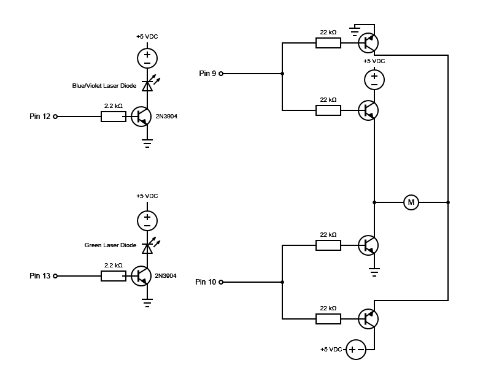

# theia-music-visualizer

## What
This is a project modifying the [Lightahead LALEDLITE 022 stage lighting unit](http://www.lightahead.us/new-2014-mini-r-g-projector-party-stage-light-for-dj-club-stage-wedding-disco-lighting-lights-show) in order to have better control over the light show it produces. Presently, the project bypasses the entire control board shipped with the unit and replaces it with an [Arduino Uno](https://www.arduino.cc/en/main/arduinoBoardUno) and standard electronic components.

Presently, the code doesn't have any music visualization components but does allow better control over the motor and the two laser diodes which ship with the unit. The intent is to use an approach akin to [Piccolo](https://learn.adafruit.com/piccolo) to turn this into a music visualizer.

## Why?
I was using the retail unit and thought it could be improved upon. I was also bored and now have an interest in lasers and music visualization.

Why Theia? It seems like a good name at the time. Theia is a Greek Titaness associated with light and divinity. Appropriate?

The standard green laser diode has been replaced with a 405nm 20mW, blue-violet, diode because it was deemed to bright. Red and blue seem to go quite nice together. But the code is, ultimately, quite agnostic to the color of diode you choose.

## Usage
1. Build out a circuit following 
2. Deploy the code in theia/theia.ino to your Arduino Uno

## Change Log
* 15-April-2016 Initial Commit

## Thanks
* [H-Bridge on a Breadboard](http://www.instructables.com/id/H-Bridge-on-a-Breadboard/)
* [Arduino Experimenter's Kit](http://oomlout.com/a/products/ardx/)
* [Circuit Diagram](http://www.circuit-diagram.org/)
